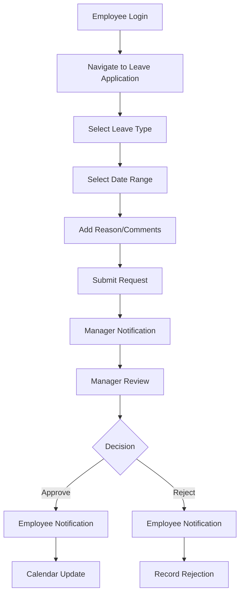
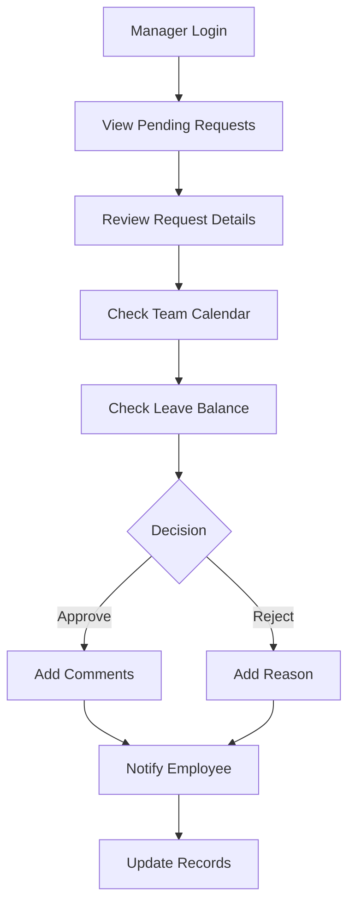
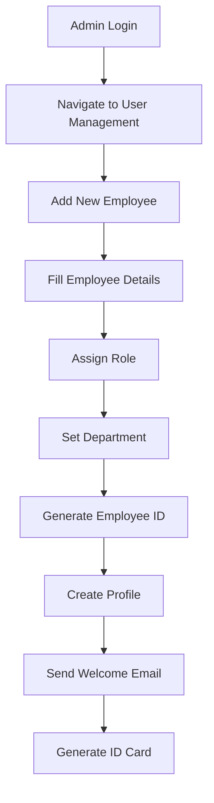

# Pronttera Connect - System Documentation

> **Last Updated:** February 03, 2026
> **Version:** 1.0.0  
> **Document Status:** Active

## 📋 Table of Contents

1. [System Overview](#system-overview)
2. [User Roles & Permissions](#user-roles--permissions)
3. [Feature Matrix](#feature-matrix)
4. [Module Documentation](#module-documentation)
5. [User Workflows](#user-workflows)
6. [Technical Architecture](#technical-architecture)
7. [Security & Access Control](#security--access-control)
8. [Change Log](#change-log)

---

## 🎯 System Overview

Pronttera Connect is a comprehensive **Employee Management & Leave Management System** designed to streamline HR processes, attendance tracking, and team collaboration for modern organizations.

### **Core Purpose**
- Centralized employee management
- Automated leave request processing
- Real-time attendance tracking
- Team calendar and scheduling
- Role-based access control
- Digital ID card generation

### **Key Business Value**
- ⚡ **Efficiency** - 80% reduction in manual paperwork
- 🎯 **Accuracy** - Automated calculations and validations
- 🔐 **Security** - Role-based data protection
- 📊 **Insights** - Real-time analytics and reporting
- 🌐 **Accessibility** - Web-based, mobile-responsive interface

---

## 👥 User Roles & Permissions

### **Role Hierarchy**

```
Admin (Full Access)
├── Manager (Department Access)
│   └── Employee (Self Access)
└── Intern (Limited Access)
```

### **Detailed Role Breakdown**

#### **👑 Admin**
**Access Level:** Full System Access  
**Primary Responsibilities:** System administration, user management, company-wide operations

| Feature | Access Level | Description |
|---------|-------------|-------------|
| **User Management** | ✅ Full | Create, edit, delete all users |
| **Leave Management** | ✅ Full | Approve/reject all leave requests |
| **Attendance** | ✅ Full | View all attendance records |
| **Reports** | ✅ Full | Generate all reports |
| **Settings** | ✅ Full | System configuration |
| **Company Holidays** | ✅ Full | Manage company holidays |
| **ID Cards** | ✅ Full | Generate all employee ID cards |
| **Dashboard** | ✅ Full | Company-wide analytics |

#### **👨‍💼 Manager**
**Access Level:** Department/Team Access  
**Primary Responsibilities:** Team management, leave approvals, team coordination

| Feature | Access Level | Description |
|---------|-------------|-------------|
| **User Management** | 🔒 Limited | View team members only |
| **Leave Management** | ✅ Team | Approve/reject team leave requests |
| **Attendance** | ✅ Team | View team attendance |
| **Reports** | 🔒 Limited | Team-specific reports |
| **Settings** | ❌ No | No access |
| **Company Holidays** | ✅ View | View holidays only |
| **ID Cards** | 🔒 Limited | Generate team ID cards |
| **Dashboard** | ✅ Team | Team analytics |

#### **👤 Employee**
**Access Level:** Self-Service Access  
**Primary Responsibilities:** Personal information management, leave requests

| Feature | Access Level | Description |
|---------|-------------|-------------|
| **User Management** | 🔒 Self | Edit own profile only |
| **Leave Management** | ✅ Self | Apply/view own leave requests |
| **Attendance** | 🔒 Self | View own attendance |
| **Reports** | ❌ No | No access |
| **Settings** | ❌ No | No access |
| **Company Holidays** | ✅ View | View holidays |
| **ID Cards** | ✅ Self | Generate own ID card |
| **Dashboard** | ✅ Self | Personal analytics |

#### **🎓 Intern**
**Access Level:** Limited Self-Service  
**Primary Responsibilities:** Learning, basic self-service tasks

| Feature | Access Level | Description |
|---------|-------------|-------------|
| **User Management** | 🔒 Self | View own profile |
| **Leave Management** | ✅ Self | Apply/view own leave |
| **Attendance** | 🔒 Self | View own attendance |
| **Reports** | ❌ No | No access |
| **Settings** | ❌ No | No access |
| **Company Holidays** | ✅ View | View holidays |
| **ID Cards** | ✅ Self | Generate own ID card |
| **Dashboard** | ✅ Self | Basic personal view |

---

## 📊 Feature Matrix

### **Complete Feature Access Overview**

| Module/Feature | Admin | Manager | Employee | Intern |
|----------------|-------|---------|----------|---------|
| **Dashboard** | 🟢 Company | 🟡 Team | 🟡 Personal | 🟡 Basic |
| **Employee Directory** | 🟢 Full | 🟡 Team | 🔒 Self | 🔒 Self |
| **Leave Application** | 🟢 All | 🟡 Team | 🟡 Self | 🟡 Self |
| **Leave Approval** | 🟢 All | 🟡 Team | ❌ No | ❌ No |
| **Leave History** | 🟢 All | 🟡 Team | 🟡 Self | 🟡 Self |
| **Attendance Tracking** | 🟢 All | 🟡 Team | 🟡 Self | 🟡 Self |
| **Team Calendar** | 🟢 All | 🟡 Team | 🟡 View | 🟡 View |
| **Company Holidays** | 🟢 Manage | 🟡 View | 🟡 View | 🟡 View |
| **ID Card Generation** | 🟢 All | 🟡 Team | 🟡 Self | 🟡 Self |
| **Settings** | 🟢 Full | ❌ No | ❌ No | ❌ No |
| **Reports** | 🟢 All | 🟡 Team | ❌ No | ❌ No |

**Legend:** 🟢 Full Access | 🟡 Limited Access | 🔒 Self Only | ❌ No Access

---

## 📚 Module Documentation

### **1. Authentication & Authorization**

#### **Login System**
- **Email-based authentication** with secure password hashing
- **Role-based access control** (RBAC) implementation
- **Session management** with automatic timeout
- **Password recovery** functionality

#### **Access Control Flow**
```
Login → Role Detection → Permission Assignment → Route Access
```

### **2. Dashboard Module**

#### **Admin Dashboard**
- **Company-wide metrics** - Total employees, leave statistics
- **Pending requests** - Real-time approval queue
- **Attendance overview** - Company-wide attendance trends
- **Quick actions** - Common admin tasks

#### **Manager Dashboard**
- **Team performance** - Team-specific metrics
- **Pending approvals** - Team leave requests
- **Team attendance** - Team attendance summary
- **Team calendar** - Team schedule view

#### **Employee Dashboard**
- **Personal statistics** - Leave balance, attendance
- **Recent activities** - Recent leave requests, approvals
- **Quick actions** - Apply leave, view calendar
- **Notifications** - Important updates

### **3. User Management Module**

#### **Admin Features**
- **Employee CRUD operations** - Create, Read, Update, Delete
- **Bulk operations** - Import/export employee data
- **Role assignment** - Assign/update user roles
- **Profile management** - Complete employee profiles
- **ID card generation** - Digital ID card creation

#### **Employee Profile Fields**
- Personal Information (Name, Email, Phone)
- Professional Information (Department, Position, Join Date)
- Emergency Contact Information
- Bank Details (for payroll integration)
- Document Attachments

### **4. Leave Management Module**

#### **Leave Types Supported**
- **Sick Leave** - Medical emergencies
- **Casual Leave** - Personal reasons
- **Annual Leave** - Vacation/time off
- **Maternity/Paternity Leave** - Family care
- **Unpaid Leave** - Special circumstances

#### **Leave Request Workflow**
```
Employee Application → Manager Review → Decision → Notification → Record Update
```

#### **Approval Hierarchy**
- **Level 1:** Direct Manager Approval
- **Level 2:** HR/Admin Approval (if required)
- **Auto-approval:** For certain leave types/balances

### **5. Attendance Management Module**

#### **Attendance Tracking**
- **Daily check-in/check-out** with timestamp
- **Break time tracking** - Automated break detection
- **Location tracking** - GPS-based (if enabled)
- **Overtime calculation** - Automatic overtime tracking

#### **Attendance Reports**
- **Daily attendance** - Individual daily records
- **Monthly summaries** - Consolidated monthly reports
- **Late arrival analysis** - Pattern identification
- **Absenteeism tracking** - Absence patterns

### **6. Team Calendar Module**

#### **Calendar Features**
- **Team schedule view** - All team members' schedules
- **Leave calendar** - Approved leave visualization
- **Holiday overlay** - Company holidays marked
- **Meeting scheduling** - Integration with calendar
- **Export functionality** - Calendar export options

#### **Calendar Views**
- **Month view** - Traditional monthly calendar
- **Week view** - Detailed weekly schedule
- **Day view** - Daily timeline view
- **Agenda view** - List of upcoming events

### **7. Company Holidays Module**

#### **Holiday Management**
- **Holiday creation** - Add company holidays
- **Holiday categories** - National, Religious, Custom
- **Recurring holidays** - Annual holiday setup
- **Holiday notifications** - Automatic holiday alerts
- **Calendar integration** - Holiday calendar sync

### **8. ID Card Generation Module**

#### **Digital ID Card Features**
- **Professional design** - Company-branded ID cards
- **QR code integration** - Quick employee verification
- **Employee photo** - Profile photo integration
- **Department information** - Department and role display
- **Validity period** - Card expiration tracking

#### **ID Card Security**
- **Unique employee ID** - System-generated ID numbers
- **Anti-forgery measures** - Security features
- **Digital signature** - Electronic verification
- **Access control** - Role-based card access

---

## 🔄 User Workflows

### **1. Employee Leave Request Workflow**



### **2. Manager Approval Workflow**



### **3. Admin User Management Workflow**



---

## 🏗️ Technical Architecture

### **System Architecture Overview**

```
Frontend (React/TypeScript)
├── Authentication Layer
├── Role-Based Routing
├── Component Library
└── State Management

Backend (Node.js/Express)
├── API Gateway
├── Authentication Middleware
├── Business Logic Layer
└── Database Layer

Database (Supabase)
├── User Management
├── Leave Records
├── Attendance Data
└── System Configuration
```

### **Technology Stack**

#### **Frontend Technologies**
- **React 18** - UI framework
- **TypeScript** - Type safety
- **Tailwind CSS** - Styling framework
- **React Router** - Navigation
- **React Query** - Data fetching
- **Supabase Auth** - Authentication
- **Lucide React** - Icons

#### **Backend Technologies**
- **Node.js** - Runtime environment
- **Express.js** - Web framework
- **TypeScript** - Type safety
- **Supabase** - Database & Auth
- **JWT** - Token authentication

#### **Database & Storage**
- **Supabase PostgreSQL** - Primary database
- **Supabase Storage** - File storage
- **Real-time subscriptions** - Live updates

### **Security Architecture**

#### **Authentication & Authorization**
- **JWT-based authentication** with refresh tokens
- **Role-based access control (RBAC)**
- **Session management** with automatic timeout
- **Password hashing** with bcrypt
- **Multi-factor authentication** (optional)

#### **Data Security**
- **Encryption at rest** - Database encryption
- **Encryption in transit** - HTTPS/TLS
- **Input validation** - XSS prevention
- **SQL injection prevention** - Parameterized queries
- **Rate limiting** - DDoS protection

---

## 🔐 Security & Access Control

### **Authentication Flow**

1. **User Login** → Email/password verification
2. **Token Generation** → JWT access + refresh tokens
3. **Role Assignment** → Permission matrix loading
4. **Session Management** → Active session tracking
5. **Access Validation** → Route-level protection

### **Permission Matrix**

| Resource | Admin | Manager | Employee | Intern |
|----------|-------|---------|----------|---------|
| `/admin/*` | ✅ | ❌ | ❌ | ❌ |
| `/manager/*` | ✅ | ✅ | ❌ | ❌ |
| `/employee/*` | ✅ | ✅ | ✅ | ✅ |
| `/api/users/*` | ✅ | 🔒 | 🔒 | 🔒 |
| `/api/leave/*` | ✅ | 🔒 | 🔒 | 🔒 |
| `/api/attendance/*` | ✅ | 🔒 | 🔒 | 🔒 |

**Legend:** ✅ Full Access | 🔒 Limited Access | ❌ No Access

### **Data Access Rules**

#### **Employee Data Access**
- **Admin:** Full access to all employee data
- **Manager:** Access to team members only
- **Employee:** Access to own data only
- **Intern:** Read access to own data only

#### **Leave Data Access**
- **Admin:** All leave requests and approvals
- **Manager:** Team leave requests and approvals
- **Employee:** Own leave requests and history
- **Intern:** Own leave requests and history

#### **Attendance Data Access**
- **Admin:** All attendance records
- **Manager:** Team attendance records
- **Employee:** Own attendance records
- **Intern:** Own attendance records

---

## 📝 Change Log

### **Version 1.0.0 - February 3, 2026**

#### **🎉 Initial Release**

**✨ New Features:**
- Complete user authentication system
- Role-based access control (Admin, Manager, Employee, Intern)
- Employee management module
- Leave request and approval system
- Attendance tracking
- Team calendar integration
- Company holidays management
- Digital ID card generation
- Responsive dashboard for all roles

**🔧 Technical Implementation:**
- React 18 + TypeScript frontend
- Node.js + Express backend
- Supabase database integration
- Real-time data synchronization
- Mobile-responsive design
- Progressive Web App (PWA) support

**🔒 Security Features:**
- JWT-based authentication
- Role-based permissions
- Input validation and sanitization
- HTTPS enforcement
- Session management

**📊 Analytics & Reporting:**
- Real-time dashboards
- Leave analytics
- Attendance reports
- Team productivity metrics

---

## 🚀 Future Roadmap

### **Planned Enhancements (Version 1.1.0)**

#### **📱 Mobile Application**
- Native iOS and Android apps
- Push notifications for leave approvals
- Offline mode support
- Biometric authentication

#### **🤖 AI-Powered Features**
- Leave pattern prediction
- Attendance anomaly detection
- Automated report generation
- Smart scheduling suggestions

#### **🔗 Integrations**
- Slack/Teams integration
- Calendar sync (Google, Outlook)
- Payroll system integration
- HRIS system connectivity

#### **📈 Advanced Analytics**
- Predictive analytics
- Custom report builder
- Data visualization tools
- Export capabilities

---

## 📞 Support & Maintenance

### **System Administration**

#### **Regular Maintenance Tasks**
- **Daily:** Database backups, log monitoring
- **Weekly:** Performance monitoring, security scans
- **Monthly:** System updates, user access reviews
- **Quarterly:** Security audits, performance optimization

#### **Support Channels**
- **Email Support:** support@pronttera.com
- **Phone Support:** +91-XXXXXXXXXX
- **Knowledge Base:** docs.pronttera.com
- **Emergency Support:** 24/7 for critical issues

### **User Training Resources**

#### **Documentation**
- **User Manuals:** Role-specific guides
- **Video Tutorials:** Step-by-step instructions
- **FAQ Section:** Common questions and answers
- **Best Practices:** Optimization tips

#### **Training Programs**
- **Admin Training:** System administration
- **Manager Training:** Team management features
- **Employee Training:** Self-service features
- **New User Onboarding:** Getting started guide

---

## 📄 Document Information

### **Document Metadata**
- **Document ID:** DOC-PRONTTERA-SYS-001
- **Version:** 1.0.0
- **Created:** February 3, 2026
- **Last Updated:** February 3, 2026
- **Next Review:** March 3, 2026
- **Owner:** System Administration Team
- **Reviewers:** Development Team, HR Team

### **Update Guidelines**

This document should be updated when:
- ✅ New features are added
- ✅ User roles or permissions change
- ✅ Workflow processes are modified
- ✅ Security policies are updated
- ✅ Technical architecture changes
- ✅ New integrations are implemented

### **Change Request Process**

1. **Identify Change** → Document the required update
2. **Review Impact** → Assess affected modules/users
3. **Update Document** → Make necessary changes
4. **Review & Approve** → Stakeholder validation
5. **Publish Update** → Distribute to all users
6. **Train Users** → Communicate changes

---

## 📞 Contact Information

### **Primary Contacts**
- **System Administrator:** admin@pronttera.com
- **Development Team:** dev@pronttera.com
- **HR Department:** hr@pronttera.com
- **Support Desk:** support@pronttera.com

### **Emergency Contacts**
- **Critical System Issues:** emergency@pronttera.com
- **Security Incidents:** security@pronttera.com
- **Data Breach:** breach@pronttera.com

---

**© 2026 Pronttera Connect. All rights reserved.**

*This document is confidential and proprietary to Pronttera Connect. Unauthorized distribution or reproduction is strictly prohibited.*
